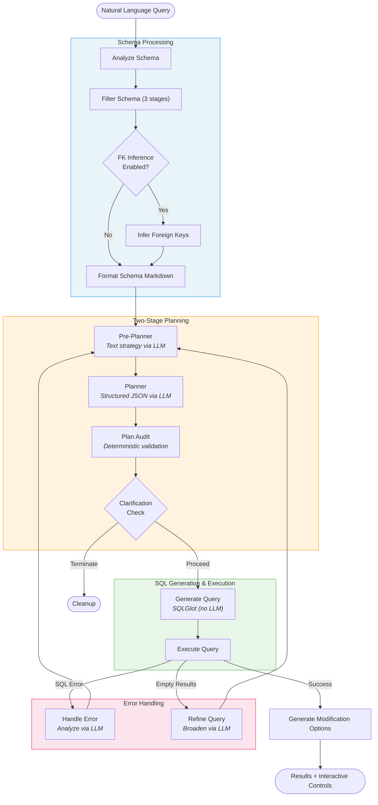
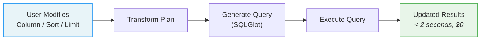

# SQL Query Assistant

Convert natural language to SQL — powered by LangGraph, deterministic SQLGlot generation, and multi-provider LLM support.

## Two implementations, one frontend

This repo ships **two parallel backends** with identical HTTP+SSE contracts. The React frontend in `demo_frontend/` works against either by switching one env var.

| Backend | Where | Stack | Default port |
|---|---|---|---|
| **Python (original)** | `agent/`, `models/`, `database/`, `utils/`, `server.py` | FastAPI + LangGraph + LangChain + SQLGlot + Chroma | `:8000` |
| **Go (rewrite)** | `go-service/` | gin + hand-rolled state machine + hand-rolled T-SQL emitter + pure-Go cosine-sim store + official OpenAI/Anthropic/Ollama SDKs | `:8001` |

The Go service is feature-equivalent — same endpoints, same SSE event shapes, same `thread_states.json` and `databases/registry.json`. See **[go-service/PARITY.md](go-service/PARITY.md)** for the matrix and **[go-service/README.md](go-service/README.md)** for build/run details. **Future major changes must land in both** — see `CLAUDE.md` for the workflow.

## Overview

SQL Query Assistant transforms natural language questions into SQL queries and executes them against your database. It uses a **hybrid architecture** where LLMs handle the reasoning (understanding your question, selecting tables, planning joins) while SQL generation is entirely **deterministic** via SQLGlot — producing reliable queries with zero LLM cost and under 10ms latency.

The system employs a **two-stage planning pipeline**: a pre-planner generates a text-based strategy describing the query approach, then a planner converts that strategy into a structured JSON plan. A deterministic join synthesizer builds the final SQL from that plan using SQLGlot's AST. This separation means the LLM never writes SQL directly — eliminating an entire class of errors.

A **3-stage schema filtering** pipeline (vector search, LLM reasoning, FK expansion) reduces database context by 60-90% before it reaches the planner, improving accuracy and reducing token costs. Strategy-first error correction loops feed failures back to the pre-planner for re-strategizing rather than patching JSON, and interactive plan patching lets users modify results (add columns, change sorting, adjust limits) in under 2 seconds with no LLM calls.

The assistant provides both a **Streamlit UI** for interactive use and a **FastAPI REST API** for integration, with support for **OpenAI**, **Anthropic**, and **local Ollama** models.

## Key Features

**Intelligent Query Planning**
- **Two-stage planning** — pre-planner creates text strategy, planner converts to structured JSON (PlannerOutput)
- **3-stage schema filtering** — vector search + LLM reasoning + FK expansion reduces context 60-90%
- **Planner complexity tiers** — minimal (8GB models, 93% token reduction), standard (13B-30B), full (GPT-4+/Claude)
- **Plan auditing** — deterministic validation catches 80-90% of common mistakes before execution

**Deterministic SQL Generation**
- **SQLGlot join synthesizer** — zero LLM calls, under 10ms, $0 cost per query
- **Multi-dialect support** — SQL Server, SQLite, PostgreSQL, MySQL
- **SQL injection prevention** — AST-based generation with automatic identifier quoting

**Smart Error Handling**
- **Strategy-first error correction** — feedback loops regenerate strategy, not JSON patches (up to 3 iterations)
- **Query refinement** — automatic broadening when queries return empty results (up to 3 iterations)
- **Graceful termination** — clear explanations when iteration limits are reached

**Interactive Query Modification**
- **Plan patching** — add/remove columns, change ORDER BY, adjust LIMIT in under 2 seconds, zero LLM cost
- **Query history** — sidebar with recent queries in the Streamlit UI

**Flexible LLM Support**
- **OpenAI** — GPT-4o, GPT-4o-mini, GPT-5 series
- **Anthropic** — Claude Sonnet 4.5, Haiku 4.5, Opus 4.1
- **Ollama** — local models (qwen3:8b, llama3, mistral) with no API costs
- **Auto mode** — mix providers per pipeline stage (e.g., Claude for strategy + GPT for planning)

**Foreign Key Inference**
- **Automatic FK discovery** — vector similarity matching for databases without explicit constraints
- **Standalone FK Agent** — interactive CLI tool with human-in-the-loop validation

## Architecture

### Query Workflow



### Plan Patching (Interactive Modifications)



LLMs handle reasoning (schema filtering, strategy generation, error analysis). SQLGlot handles all SQL generation deterministically. Error correction feeds strategic guidance back to the pre-planner rather than patching SQL or JSON directly.

## Quick Start

### Prerequisites

- **Python 3.9+**
- **SQL Server** with ODBC Driver 17 — or use `USE_TEST_DB=true` for the built-in SQLite test database
- **LLM access** — an OpenAI or Anthropic API key, or [Ollama](https://ollama.com) installed locally

### Installation

```bash
git clone https://github.com/sachnaror/sql-query-assistant.git
cd sql-query-assistant
python -m venv venv
source venv/bin/activate  # Windows: venv\Scripts\activate
pip install -r requirements.txt
```

### Configuration

```bash
cp .env.example .env
# Edit .env with your settings
```

**Minimal setup with OpenAI + test database:**
```env
USE_LOCAL_LLM=false
REMOTE_LLM_PROVIDER=openai
OPENAI_API_KEY=sk-...
USE_TEST_DB=true
```

**Minimal setup with local Ollama:**
```env
USE_LOCAL_LLM=true
AI_MODEL=qwen3:8b
PLANNER_COMPLEXITY=minimal
USE_TEST_DB=true
```

### Run

**Python backend (port 8000):**
```bash
# Streamlit UI (interactive)
streamlit run streamlit_app.py

# FastAPI server (REST API)
uvicorn server:app --host 0.0.0.0 --port 8000
# API docs: http://localhost:8000/docs
```

**Go backend (port 8001) — equivalent feature set:**
```bash
cd go-service
go build -o sql-go-service.exe ./cmd/server
USE_TEST_DB=true PORT=8001 ./sql-go-service.exe
```

The two backends can run side by side. The frontend's `vite.config.ts` defaults the proxy to `:8001` (Go); override with `VITE_API_URL=http://localhost:8000 npm run dev` to point at Python instead.

## Usage

### Streamlit UI

Type a natural language question (e.g., "Show me the top 10 customers by total spending"), view the generated SQL and results as a table, then use the interactive modification controls to add/remove columns, change sorting, or adjust the row limit — all without re-running the LLM.

### FastAPI REST API

```bash
curl -X POST http://localhost:8000/query \
  -H "Content-Type: application/json" \
  -d '{"prompt": "Show me the top 10 customers by total spending", "result_limit": 10}'
```

API documentation is available at `http://localhost:8000/docs` (Swagger UI).

### Docker

```bash
docker build -t sql-query-assistant .
docker run -d --env-file .env -p 8000:8000 sql-query-assistant
```

When using Docker with a local SQL Server, set `DB_SERVER=host.docker.internal` in your `.env` file.

## How It Works

1. **Schema Analysis** — introspects the full database schema: tables, columns, data types, and foreign keys
2. **Schema Filtering** — 3-stage reduction: vector similarity finds the top-k candidate tables, LLM reasoning evaluates relevance, FK expansion adds related tables. Reduces context by 60-90%.
3. **FK Inference** (optional) — discovers missing FK relationships using vector similarity on ID column naming patterns (e.g., `CompanyID` → `tb_Company`)
4. **Pre-Planning** — LLM generates a text-based strategy: which tables to use, how to join them, what filters to apply. Incorporates feedback from previous error/refinement attempts.
5. **Planning** — LLM converts the text strategy into a structured `PlannerOutput` (Pydantic model) with table selections, join edges, filters, aggregations, ORDER BY, and LIMIT
6. **Plan Audit** — deterministic validation fixes common mistakes: invalid columns, orphaned filters, incomplete GROUP BY clauses, bad joins
7. **SQL Generation** — SQLGlot join synthesizer builds a SQL AST from the plan. No LLM calls — purely algorithmic, under 10ms, $0 cost. Automatic identifier quoting prevents reserved keyword errors.
8. **Execution** — runs the generated SQL against the database and returns results
9. **Error Correction** — if the SQL fails: LLM analyzes the error, generates strategic feedback, routes back to the pre-planner for re-strategizing (up to 3 iterations)
10. **Refinement** — if the query returns empty results: LLM analyzes why, suggests a broader approach, routes back to the pre-planner (up to 3 iterations)

## LLM Provider Configuration

### Provider Options

| Provider | `USE_LOCAL_LLM` | `REMOTE_LLM_PROVIDER` | Required Keys |
|----------|:---------------:|:---------------------:|---------------|
| OpenAI | `false` | `openai` | `OPENAI_API_KEY` |
| Anthropic | `false` | `anthropic` | `ANTHROPIC_API_KEY` |
| Mixed (auto) | `false` | `auto` | Both API keys |
| Ollama (local) | `true` | *(ignored)* | None |

### Per-Stage Model Configuration

You can assign different models to different pipeline stages for cost/quality optimization:

```env
REMOTE_LLM_PROVIDER=auto
REMOTE_MODEL_STRATEGY=claude-sonnet-4-5         # Claude for complex reasoning
REMOTE_MODEL_PLANNING=gpt-4o-mini               # GPT for structured output
REMOTE_MODEL_FILTERING=gpt-4o-mini              # GPT for schema filtering
REMOTE_MODEL_ERROR_CORRECTION=claude-haiku-4-5   # Claude Haiku for quick fixes
REMOTE_MODEL_REFINEMENT=gpt-4o-mini             # GPT for refinement
```

### Planner Complexity Tiers

Set via `PLANNER_COMPLEXITY` in `.env`:

| Tier | Target Models | Prompt Tokens | Features |
|------|---------------|:-------------:|----------|
| `minimal` | qwen3:8b, llama3:8b, mistral:7b | ~265 (93% reduction) | Core SQL: selections, joins, filters, GROUP BY, ORDER BY, LIMIT |
| `standard` | mixtral:8x7b, qwen2.5:14b | ~1,500 (61% reduction) | + Reason fields for debugging |
| `full` | GPT-4o, Claude Sonnet 4.5 | ~3,832 (baseline) | + Window functions, CTEs, subqueries |

## Domain-Specific Configuration

Customize the system for your database through JSON configuration files in `domain_specific_guidance/`:

| File | Purpose |
|------|---------|
| `domain-specific-guidance-instructions.json` | Map domain terminology to database concepts |
| `domain-specific-table-metadata.json` | Table descriptions and column metadata |
| `domain-specific-foreign-keys.json` | Define FK relationships for accurate JOINs |
| `domain-specific-sample-queries.json` | Sample queries for the UI sidebar |

Example templates (`.example.json` files) are provided. See [domain_specific_guidance/README.md](domain_specific_guidance/README.md) for detailed setup instructions.

## Project Structure

```
sql-query-assistant/
  agent/                            # LangGraph workflow nodes
    create_agent.py                 #   Workflow graph definition and routing
    state.py                        #   State TypedDict (40+ fields)
    pre_planner.py                  #   Stage 1: text strategy generation
    planner.py                      #   Stage 2: structured JSON planning
    filter_schema.py                #   3-stage schema filtering
    generate_query.py               #   Deterministic SQL generation (SQLGlot)
    handle_tool_error.py            #   Strategy-first error correction
    refine_query.py                 #   Empty results refinement
    plan_audit.py                   #   Deterministic plan validation
    ...
  models/                           # Pydantic data models
    planner_output.py               #   Full planner model (GPT-4+)
    planner_output_standard.py      #   Standard tier (13B-30B)
    planner_output_minimal.py       #   Minimal tier (8GB)
  database/                         # Database layer
    connection.py                   #   Connection management (SQL Server + SQLite)
    introspection.py                #   SQLAlchemy-based schema introspection
    infer_foreign_keys.py           #   FK inference logic (vector similarity)
  utils/                            # Utilities
    llm_factory.py                  #   LLM provider abstraction (OpenAI/Anthropic/Ollama)
    logger.py                       #   Structured logging
  domain_specific_guidance/         # Domain configuration (JSON files)
  fk_inferencing_agent/             # Standalone FK discovery CLI tool
  tests/unit/                       # Unit tests (37+ test files, 80+ tests)
  streamlit_app.py                  # Streamlit UI
  server.py                         # FastAPI REST API
  requirements.txt                  # Python dependencies (56 packages)
  Dockerfile                        # Container configuration
  .env.example                      # Environment variable template

  go-service/                       # Go reimplementation — feature-equivalent to Python
    cmd/server/main.go              #   Entry point (gin + slog)
    internal/server/                #   gin handlers + SSE for all 10 endpoints
    internal/agent/                 #   Hand-rolled state machine + 18 workflow nodes
    internal/chat/                  #   Agentic chat loop + sessions + tools
    internal/llm/                   #   OpenAI + Anthropic + Ollama clients
    internal/sql/                   #   T-SQL + SQLite emitter (replaces SQLGlot)
    internal/{vector,fk,cancel,...} #   Supporting packages
    PARITY.md                       #   Endpoint + node feature matrix
    POST_MVP.md                     #   Remaining deferred items
    TEST_COVERAGE.md                #   Go test inventory mapped to Python tests
    Dockerfile                      #   Multi-stage distroless (~30 MB image)
```

## Development

> **Two-backend rule:** Major feature changes (new endpoint, new workflow node, schema changes, new SSE event types, new SQL emitter features, new LLM provider) MUST land in BOTH the Python service and the Go service. See `CLAUDE.md` for the workflow and the file-by-file mapping.

### Testing

**Python:**
```bash
pytest                                     # Run all tests
pytest tests/unit/test_plan_audit.py -v    # Run specific test file
pytest -v                                  # Verbose output
```

**Go:**
```bash
cd go-service
go test -short ./...                       # Unit + structural tests (fast)
go test ./...                              # Includes live LLM/SQLite e2e tests
```

**Cross-service parity check:**
```bash
# With Python on :8000 and Go on :8001 both running:
./go-service/scripts/parity_check.sh
```
Replays prompts against both services and diffs the SSE event sequence + final SQL/row counts.

Tests cover SQL generation, plan auditing, schema filtering, plan patching, dialect compatibility, reserved keyword handling, ORDER BY/LIMIT, and more — see `go-service/TEST_COVERAGE.md` for the file-by-file mapping between Python and Go test suites.

### Linting

```bash
flake8 .
```

Configuration in `.flake8`: max line length 120, ignores E203.

### FK Inference Agent

Interactive CLI tool for discovering FK relationships with human-in-the-loop validation:

```bash
python -m fk_inferencing_agent.cli --database mydb --threshold 0.15 --top-k 5
```

See [fk_inferencing_agent/README.md](fk_inferencing_agent/README.md) for detailed documentation.

## Performance

| Metric | Value |
|--------|-------|
| SQL generation latency | < 10ms (deterministic, no LLM) |
| SQL generation cost | $0 per query (zero LLM calls) |
| Schema context reduction | 60-90% via 3-stage filtering |
| Plan audit error prevention | 80-90% of common mistakes caught pre-execution |
| Plan patching speed | < 2 seconds (deterministic, no LLM) |
| Token reduction (minimal tier) | 93% vs full tier |

<details>
<summary><h2>Environment Variables Reference</h2></summary>

### LLM Provider

| Variable | Default | Description |
|----------|---------|-------------|
| `USE_LOCAL_LLM` | `false` | Use local Ollama (`true`) or remote provider (`false`) |
| `REMOTE_LLM_PROVIDER` | `openai` | Remote provider: `openai`, `anthropic`, or `auto` |
| `OPENAI_API_KEY` | | OpenAI API key |
| `ANTHROPIC_API_KEY` | | Anthropic API key |
| `OLLAMA_BASE_URL` | `http://localhost:11434` | Ollama server URL (when `USE_LOCAL_LLM=true`) |

### Model Selection

| Variable | Default | Description |
|----------|---------|-------------|
| `AI_MODEL` | | Primary model for query planning |
| `REMOTE_MODEL_STRATEGY` | | Pre-planner model (remote) |
| `REMOTE_MODEL_PLANNING` | | Planner model (remote) |
| `REMOTE_MODEL_FILTERING` | | Schema filtering model (remote) |
| `REMOTE_MODEL_ERROR_CORRECTION` | | Error correction model (remote) |
| `REMOTE_MODEL_REFINEMENT` | | Refinement model (remote) |
| `LOCAL_MODEL_STRATEGY` | | Pre-planner model (Ollama) |
| `LOCAL_MODEL_PLANNING` | | Planner model (Ollama) |
| `LOCAL_MODEL_FILTERING` | | Schema filtering model (Ollama) |
| `LOCAL_MODEL_ERROR_CORRECTION` | | Error correction model (Ollama) |
| `LOCAL_MODEL_REFINEMENT` | | Refinement model (Ollama) |
| `PLANNER_COMPLEXITY` | `minimal` | Planner tier: `minimal`, `standard`, or `full` |

### Database

| Variable | Default | Description |
|----------|---------|-------------|
| `DB_SERVER` | | SQL Server hostname |
| `DB_NAME` | | Database name |
| `DB_USER` | | Database username |
| `DB_PASSWORD` | | Database password |
| `USE_TEST_DB` | `false` | Use built-in SQLite test database |

### Query Configuration

| Variable | Default | Description |
|----------|---------|-------------|
| `ERROR_CORRECTION_COUNT` | `3` | Max error correction iterations |
| `REFINE_COUNT` | `2` | Max refinement iterations for empty results |
| `TOP_MOST_RELEVANT_TABLES` | `8` | Number of tables to retrieve via vector search |
| `EMBEDDING_MODEL` | `text-embedding-3-small` | Embedding model for vector search |

### Foreign Key Inference

| Variable | Default | Description |
|----------|---------|-------------|
| `INFER_FOREIGN_KEYS` | `false` | Enable automatic FK inference |
| `FK_INFERENCE_CONFIDENCE_THRESHOLD` | `0.6` | Minimum confidence for inferred FKs (0.0-1.0) |
| `FK_INFERENCE_TOP_K` | `3` | Candidate tables per ID column |

### Debug

| Variable | Default | Description |
|----------|---------|-------------|
| `ENABLE_DEBUG_FILES` | `true` | Write debug files (planner output, SQL, schema) |

</details>

## Documentation

For deeper dives into specific topics:

- **[WORKFLOW_DIAGRAM.md](WORKFLOW_DIAGRAM.md)** — complete workflow diagrams with routing logic
- **[JOIN_SYNTHESIZER.md](JOIN_SYNTHESIZER.md)** — deterministic SQL generation architecture
- **[CHAT_ARCHITECTURE.md](CHAT_ARCHITECTURE.md)** — conversational data assistant (agentic loop, tool calling, session management)
- **[domain_specific_guidance/README.md](domain_specific_guidance/README.md)** — domain configuration guide
- **[fk_inferencing_agent/README.md](fk_inferencing_agent/README.md)** — FK inference CLI tool
- **[CLAUDE.md](CLAUDE.md)** — comprehensive development guide (architecture, patterns, debugging)
